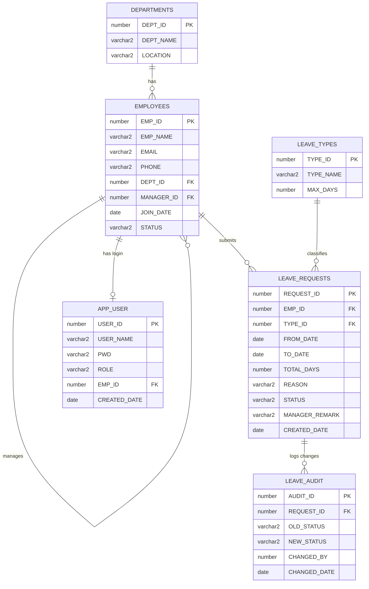
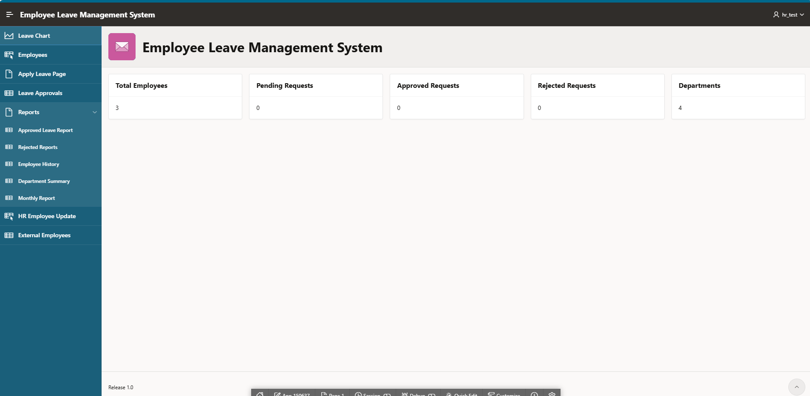
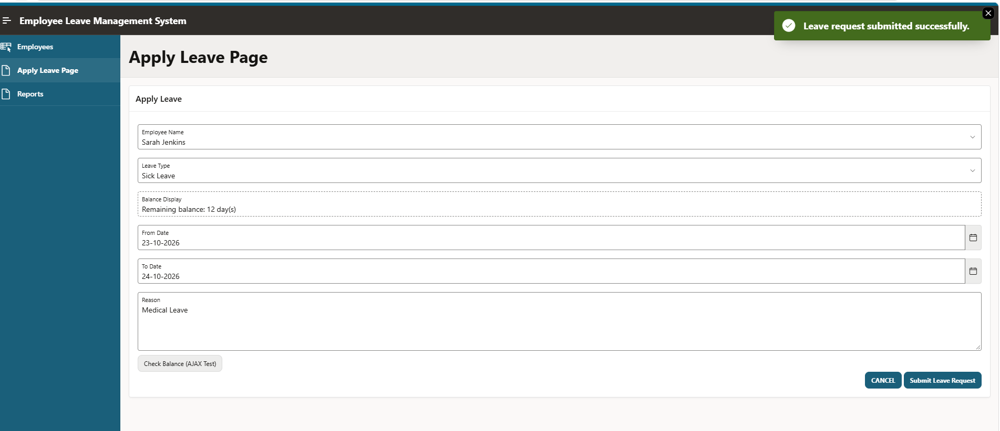
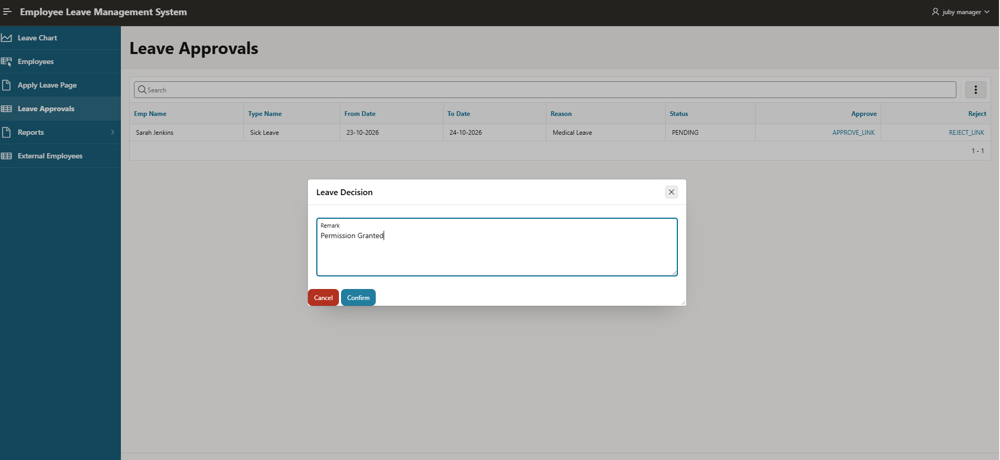
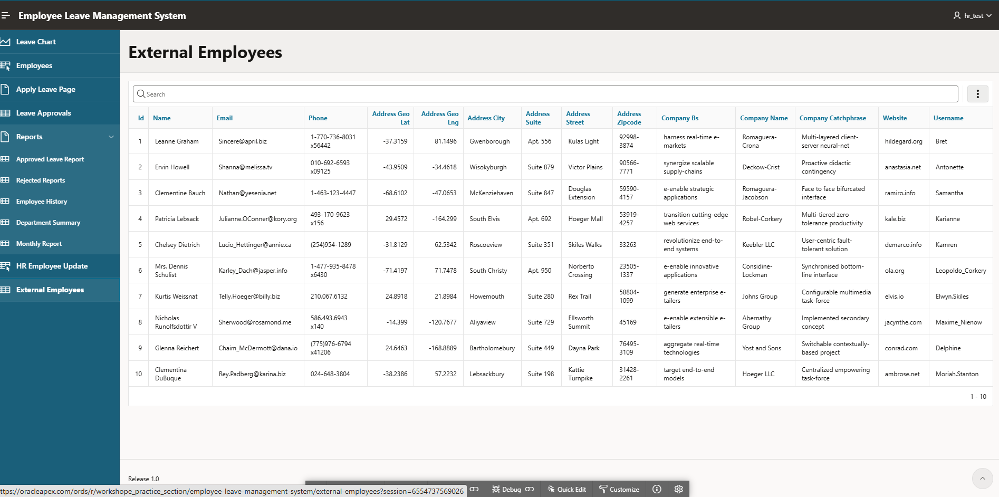

# Employee Leave Management System — Oracle APEX

A full-stack Employee Leave Management System built end-to-end in **Oracle
APEX**, covering PL/SQL business logic, triggers, REST API design
(both consuming and exposing endpoints), role-based security with
row-level data access, performance tuning backed by `EXPLAIN PLAN`
evidence, and real debugging write-ups from development.

Built as a complete capstone project — not a tutorial walkthrough — to
demonstrate practical, production-style Oracle APEX development: a
manager approves/rejects leave through an audited workflow, HR manages
employee records through a validated Interactive Grid, dashboards and
reports summarize activity, and three roles (Employee, Manager, HR/Admin)
each see only the data and pages they're entitled to.

---

## Completed Features

| # | Feature | Status |
|---|---|---|
| 1 | Schema design (6 tables, FKs, constraints) | ✅ |
| 2 | `PKG_LEAVE` package — create/approve/reject leave, balance lookup | ✅ |
| 3 | Sequence-based primary key (`LEAVE_REQUESTS_SEQ`, NOCACHE) | ✅ |
| 4 | Triggers — auto-calculated fields + full audit trail | ✅ |
| 5 | Dashboard — summary cards and charts | ✅ |
| 6 | Master pages (Departments, Employees, Leave Types) | ✅ |
| 7 | Apply Leave page — validated transactional form | ✅ |
| 8 | Approval workflow — modal decision page, audit-logged | ✅ |
| 9 | Reports — 5 exportable reports with conditional aggregation | ✅ |
| 10 | HR Employee Update — editable Interactive Grid with validation | ✅ |
| 11 | Dynamic Actions — live balance lookup, Submit-button gating | ✅ |
| 12 | REST Data Source consumption (JSONPlaceholder) | ✅ |
| 13 | ORDS REST API exposure — full CRUD, all 4 verbs tested | ✅ |
| 14 | PL/SQL AJAX Callback | ✅ |
| 15 | JavaScript/jQuery enhancements — confirmations, notifications | ✅ |
| 16 | Custom CSS theming, responsive layout | ✅ |
| 17 | Role-based security — auth schemes, session state protection | ✅ |
| 18 | Debugging — 4 real bugs documented with root-cause analysis | ✅ |
| 19 | Performance tuning — index review + `EXPLAIN PLAN` fix | ✅ |
| 20 | Testing — 7-case automated test suite for `PKG_LEAVE` | ✅ |
| 21 | Full documentation — this README, ER diagram, deployment guide | ✅ |
| — | **Bonus:** page-level + row-level access control by role | ✅ |

See `DEBUGGING.md` and `PERFORMANCE.md` for the two write-ups with real
evidence (actual error messages, `EXPLAIN PLAN` output, and fixes) — these
are the strongest signal of hands-on debugging ability, not staged
examples.

---

## 1. Entity-Relationship Diagram



**Notes:**
- `EMPLOYEES.MANAGER_ID` is a self-referencing FK (an employee's manager is
  another row in the same table).
- `LEAVE_REQUESTS.REQUEST_ID` is sequence-generated
  (`LEAVE_REQUESTS_SEQ`, `NOCACHE`) rather than an identity column, to
  satisfy the assignment's sequence requirement.
- `APP_USER.EMP_ID` links the custom authentication/authorization layer
  back to the employee record it represents.

---

## 2. Application Flow

| Page | Purpose |
|------|---------|
| **Dashboard** | Summary cards (total employees, pending/approved/rejected requests, departments) and charts (leaves per department, monthly leave trend). |
| **Master Pages** | CRUD management for Departments, Employees, and Leave Types. |
| **Apply Leave** | Employee-facing form to submit a leave request. Validates required fields, no past dates, no overlapping leave, and shows a live remaining-balance lookup via a Dynamic Action + AJAX Callback. |
| **Leave Approvals** | Manager-facing Interactive Report of all Pending requests, with Approve/Reject links restricted by an Authorization Scheme. |
| **Leave Decision** (modal) | Confirms an Approve/Reject decision with an optional remark; calls `PKG_LEAVE`, closes, and refreshes the parent report. |
| **Reports** | Approved Leaves, Rejected Leaves, Employee Leave History, Department Summary, Monthly Report — all exportable. |
| **HR Employee Update** | Interactive Grid for HR to edit employee Phone/Status/Department, with regex-validated phone numbers and a manager-name lookup. |
| **External Employees** | Interactive Report consuming a public REST Data Source (JSONPlaceholder) to demonstrate external API integration. |

**Core request lifecycle:**
```
Employee submits (Apply Leave)
        │
        ▼
   STATUS = PENDING  ──────► Trigger auto-fills TOTAL_DAYS, CREATED_DATE
        │
        ▼
Manager reviews (Leave Approvals → Leave Decision modal)
        │
        ├── Approve → PKG_LEAVE.APPROVE_LEAVE → STATUS = APPROVED
        └── Reject  → PKG_LEAVE.REJECT_LEAVE  → STATUS = REJECTED
        │
        ▼
Audit trigger logs the status change into LEAVE_AUDIT
```

---

## 3. Database Objects

**Tables:** `DEPARTMENTS`, `EMPLOYEES`, `LEAVE_TYPES`, `LEAVE_REQUESTS`,
`LEAVE_AUDIT`, `APP_USER`

**Sequence:** `LEAVE_REQUESTS_SEQ` (NOCACHE)

**Triggers:**
| Trigger | Fires | Purpose |
|---|---|---|
| `TRG_LEAVE_REQUESTS_BI` | BEFORE INSERT ON LEAVE_REQUESTS | Auto-calculates `TOTAL_DAYS`, defaults `CREATED_DATE`. |
| `TRG_LEAVE_REQUESTS_AUDIT` | AFTER UPDATE OF STATUS ON LEAVE_REQUESTS | Writes an audit row whenever status actually changes. |

**Indexes:** see `PERFORMANCE.md` for the full review, including the
function-based index added to support `UPPER(STATUS)` filtering.

**Package: `PKG_LEAVE`**
| Procedure/Function | Purpose |
|---|---|
| `CREATE_LEAVE` | Validates and inserts a new leave request (join-date check, date-order check, max-duration check, balance check). |
| `APPROVE_LEAVE` | Approves a Pending request; records the deciding manager via `G_CURRENT_MANAGER_ID` for the audit trigger. |
| `REJECT_LEAVE` | Rejects a Pending request, same manager-tracking mechanism. |
| `GET_LEAVE_BALANCE` | Returns an employee's remaining balance for a given leave type. |

**Standalone functions (security layer):**
| Function | Purpose |
|---|---|
| `GET_CURRENT_USER_ROLE` | Returns the logged-in user's role from `APP_USER`. |
| `GET_CURRENT_EMP_ID` | Returns the logged-in user's linked `EMP_ID`. |

**Authorization Schemes:**
| Scheme | Rule |
|---|---|
| Can Approve Leave | `GET_CURRENT_USER_ROLE() IN ('MANAGER','HR')` |
| Admin Only | `GET_CURRENT_USER_ROLE() = 'ADMIN'` |

---

## 4. REST API

### Consumed (REST Data Source)
- **JSONPlaceholder Users** — `https://jsonplaceholder.typicode.com/users`, Simple HTTP, no authentication. Displayed via the "External Employees" Interactive Report.

### Exposed (ORDS Module: `employee.api`, base path `/employees/`)
| Method | Template | Behavior |
|---|---|---|
| GET | `/` | Returns all employees (Collection Query). |
| POST | `/` | Creates a new employee (PL/SQL). |
| GET | `/{id}` | Returns one employee (Feed/Row Query). |
| PUT | `/{id}` | Updates an employee's editable fields (PL/SQL). |
| DELETE | `/{id}` | Deletes an employee (PL/SQL). |

All four verbs were tested directly: GET via browser URL, PUT/DELETE via
`APEX_WEB_SERVICE.MAKE_REST_REQUEST` called from SQL Commands.

---

## 5. Security

Security is enforced at three layers, not just one — a login role check
alone wouldn't stop a user from reaching a page by URL or reading another
employee's rows through a report.

**Page-level :**
- Role-based Authorization Schemes attached directly to pages — e.g. HR
  Employee Update and the Master Pages are restricted to HR/Admin;
  Leave Approvals and the Decision modal to Manager/Admin.
- Navigation menu entries carry matching Authorization Schemes so
  restricted links aren't even shown to a role that can't use them.

**Row-level (which rows they see once a page is open):**
- Reports and the Employees view filter rows using
  `GET_CURRENT_USER_ROLE()` / `GET_CURRENT_EMP_ID()`: an Employee only
  ever sees their own record and their own leave history; Manager/HR/Admin
  see everyone.
- The Apply Leave employee picker uses the same filtering at the List of
  Values level — an Employee's dropdown only ever contains their own
  name; Manager/HR/Admin can select any employee (to file leave on their
  behalf).

**Action-level (what they can do with what they see):**
- `Can Approve Leave` and `Admin Only` Authorization Schemes gate the
  Approve/Reject links and destructive HR actions.
- Page Access Protection = **Arguments Must Have Checksum** on the Leave
  Decision modal; its hidden items (`P16_REQUEST_ID`, `P16_ACTION`) use
  **Checksum Required** Session State Protection to prevent URL tampering.
- SQL injection is prevented inherently by APEX bind-variable substitution
  (`:P3_EMP_NAME`, etc.) — no string-concatenated SQL anywhere in the app.

**Supporting functions:**
```sql
GET_CURRENT_USER_ROLE()   -- returns the logged-in user's role from APP_USER
GET_CURRENT_EMP_ID()      -- returns the logged-in user's linked EMP_ID
```
Both are used as reusable building blocks across every layer above, rather
than duplicating role/identity lookups in each page or query.

---

## 6. Deployment

1. Run the DDL for all six tables in schema-dependency order: `DEPARTMENTS` → `EMPLOYEES` → `LEAVE_TYPES` → `LEAVE_REQUESTS` → `LEAVE_AUDIT` → `APP_USER`.
2. Create `LEAVE_REQUESTS_SEQ`.
3. Create the two triggers (`TRG_LEAVE_REQUESTS_BI`, `TRG_LEAVE_REQUESTS_AUDIT`).
4. Create `PKG_LEAVE` (spec, then body).
5. Create `GET_CURRENT_USER_ROLE` and `GET_CURRENT_EMP_ID`.
6. Load seed data (departments, employees, leave types).
7. Import the APEX application export (`f<app_id>.sql`) via SQL Workshop → Utilities → Import, then run the Application install script.
8. In Shared Components, re-point the REST Data Source and re-enable the ORDS module if the export didn't carry workspace-specific ORDS config.
9. Re-create the Authorization Schemes and Authentication Scheme if they were not included in the export (ORDS/auth config is sometimes workspace-specific).
10. Verify by logging in as a seeded `APP_USER` row and walking through: apply leave → approve → check audit → run a report.

---

## 8. Screenshots





---

## Related Documents

- [`PERFORMANCE.md`](./PERFORMANCE.md) — index review and an EXPLAIN PLAN-driven fix.
